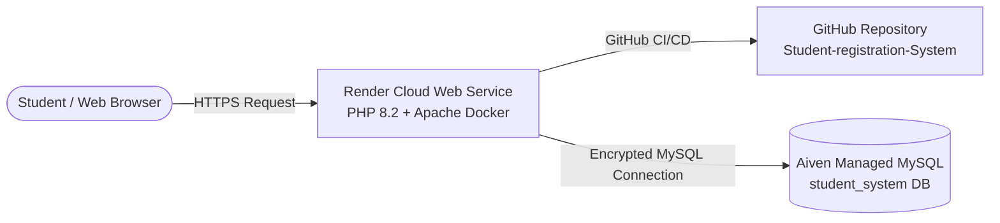

# 🎓 Student Registration System — Portal 2.0

A modern, secure, and production-ready **Student Registration & Portal Management System** engineered with **PHP**, **MySQL**, **CSS3 (Flat Design System)**, and **Vanilla JavaScript**. Designed and developed as a comprehensive college group project.

---

## 🌐 Live Demo & Deployment

| Resource | URL |
|---|---|
| **🚀 Live Production Website** | **[https://student-registration-system-j2e6.onrender.com/](https://student-registration-system-j2e6.onrender.com/)** |
| **🛠️ Database Setup / Migration** | **[https://student-registration-system-j2e6.onrender.com/setup_database.php](https://student-registration-system-j2e6.onrender.com/setup_database.php)** |
| **📦 GitHub Repository** | **[https://github.com/rjpogi1830-netizen/Student-registration-System](https://github.com/rjpogi1830-netizen/Student-registration-System)** |

---

## 👥 Project Group Members

| Name | Role / Contribution |
|---|---|
| **Francis Tabuzo Jr.** | Full-Stack Development & Architecture |
| **Arus Sta Rosa** | Frontend Design System & UI/UX |
| **Rohn Bon** | Database Engineering & SQL Schemas |
| **Dave Emmanuel Hore** | Security, Testing & Documentation |

---

## 🛠️ Complete Tech Stack

| Layer | Technology | Details |
|---|---|---|
| **Backend Engine** | **PHP 7.4+ / PHP 8.x** | Pure procedural & object-oriented PHP (Zero external frameworks) |
| **Database** | **MySQL 5.7+ / MariaDB** | Relational database with `utf8mb4` character encoding |
| **Frontend Markup** | **HTML5** | Semantic, accessible, and structured markup with inline SVG icons |
| **Styling & Design** | **CSS3 (Pure Flat Design)** | Custom properties (CSS variables), Google Font *Outfit*, zero box-shadows, strict color blocking |
| **Client-Side UX** | **Vanilla JavaScript (ES6)** | Password strength meter, show/hide password toggles, real-time confirmation validation, mobile nav drawer, smooth scrolling |
| **Containerization** | **Docker** | Official `php:8.2-apache` runtime with `mysqli` extension enabled |
| **Cloud Hosting** | **Render (Web Service)** | Containerized cloud deployment with automatic GitHub CI/CD |
| **Cloud Database** | **Aiven (Managed MySQL)** | High-availability cloud-hosted MySQL with SSL encryption |
| **Local Development** | **XAMPP** | Apache HTTP Server + MariaDB MySQL + phpMyAdmin |
| **Version Control** | **Git & GitHub** | Source code management with branch-based deployment |

---

## 📖 About the Website

The **Student Registration System** provides educational institutions with a lightweight, secure, and intuitive web portal where students can register an account, authenticate securely, review their personal student overview, and manage their profile details in real-time.

Unlike generic school assignments, this application is built with a **production-grade UX/UI**, eliminating bloat while maintaining **100% genuine database integration** without placeholder/mock data.

---

## 🌟 Key Features & Webpage Breakdown

### 1. Landing Page (`index.php`)
- **Navigation Bar**: Sticky navigation with brand identity, smooth-scrolling section links (`#home`, `#features`, `#how-it-works`, `#benefits`, `#team`), mobile drawer menu, and quick action buttons.
- **Hero Section**: High-impact blue color block with headline, supporting copy, primary CTA buttons, and a flat dashboard preview mockup with geometric background accents.
- **Core Features**: 4 color-block cards featuring inline SVG vector icons:
  1. *Easy Registration* (Blue)
  2. *Secure Authentication* (Emerald)
  3. *Student Dashboard* (Amber)
  4. *Profile Management* (Muted)
- **How It Works**: Dark-themed 3-step procedural workflow (`01 Register`, `02 Sign In`, `03 Access Dashboard`).
- **Benefits Section**: Emerald color block highlighting *Fast & Responsive*, *Simple Navigation*, *Multi-Device Support*, and *Organized Information*.
- **Meet the Team Section**: 4-column responsive grid showcasing the group members (**Francis Tabuzo Jr.**, **Arus Sta Rosa**, **Rohn Bon**, **Dave Emmanuel Hore**) with geometric avatar placeholders and subtle 200ms scale-hover interactions.
- **Call to Action (CTA)**: Amber high-conversion banner directing students to create their account.
- **Footer**: Structured links, project description, and dynamic copyright year.

### 2. Student Registration (`register.php`)
- **Split-Screen Layout**: Left branding panel with feature highlights + right interactive form.
- **Real-Time Password Strength Meter**: Live scoring bar and label evaluating password length, mixed-case letters, numbers, and special characters.
- **Password Visibility Toggles**: Interactive show/hide buttons for both Password and Confirm Password with dynamic SVG Eye / Eye-Off icons.
- **Instant Password Match Validation**: Client-side feedback before form submission.
- **Form Value Retention**: Preserves entered `fullname` and `email` on validation errors.
- **Duplicate Prevention**: Rejects duplicate email addresses using prepared SQL queries.
- **Bcrypt Password Hashing**: Passwords hashed securely using `password_hash($password, PASSWORD_DEFAULT)`.

### 3. Student Login (`login.php`)
- **Split-Screen Layout**: Unified visual identity matching registration.
- **Flash Success Alert**: Displays a green notification banner when redirected after successful registration (`login.php?registered=1`).
- **Password Visibility Toggle**: Show/hide password option.
- **Secure Authentication**: Validates credentials using `password_verify($password, $user['password'])`.
- **Session Management**: Initializes secure PHP session variables (`$_SESSION['user_id']`, `$_SESSION['fullname']`, `$_SESSION['email']`).

### 4. Student Portal Dashboard (`dashboard.php`)
- **Persistent Sidebar Navigation**: Brand logo, active navigation indicators (*Dashboard*, *My Profile*, *Account Settings*), student user badge with initials avatar, and quick logout.
- **Greeting Banner**: Personalized banner (`Good day, [Student Name]`).
- **3 Live Stat Blocks**:
  1. *Account Status*: Active (with green indicator dot)
  2. *Profile Status*: Complete (with blue indicator)
  3. *Member Since*: Dynamic registration date queried directly from MySQL `created_at` (e.g. *Aug 24, 2026*)
- **Account Overview Table**: Strictly genuine database fields:
  - *Full Name* (`fullname`)
  - *Email Address* (`email`)
  - *Account ID* (`#ACC-0000{id}`)
  - *Registration Date* (`created_at`)
- **Quick Action Shortcuts**: Fast links to View Profile, Edit Information, or Logout.

### 5. Profile & Live MySQL Editor (`profile.php`)
- **Account Details Card**: Overview of verified student record.
- **Authentic Profile Editing**: Allows students to update their **Full Name** and **Email Address**.
- **Backend Execution**:
  - Validates input formats.
  - Ensures updated email is not taken by another user (`WHERE email = ? AND id != ?`).
  - Executes prepared `UPDATE users SET fullname = ?, email = ? WHERE id = ?`.
  - Immediately refreshes active PHP session variables (`$_SESSION['fullname']`, `$_SESSION['email']`).
  - Displays dismissible success / error alert banners.

### 6. Cloud Database Migration & Verification (`setup_database.php`)
- Dedicated visual verification utility that tests the MySQL connection and automatically executes `CREATE TABLE IF NOT EXISTS users (...)`.
- Displays real-time database host, database name, port, charset, and table status.

### 7. Secure Logout (`logout.php`)
- Clears session variables with `session_unset()`, destroys the session with `session_destroy()`, and redirects cleanly to `index.php`.

---

## 🔒 Security & Best Practices

- 🛡️ **Bcrypt Password Encryption**: Passwords are never stored in plain text. Uses PHP's native `password_hash()` and `password_verify()`.
- 💉 **SQL Injection Prevention**: 100% of database queries execute through Prepared Statements (`$stmt->prepare()` and `$stmt->bind_param()`).
- 🛑 **Cross-Site Scripting (XSS) Prevention**: All dynamic user outputs are escaped using `htmlspecialchars($data, ENT_QUOTES, 'UTF-8')`.
- 🔐 **Session Guards**: Protected pages (`dashboard.php`, `profile.php`) redirect unauthenticated visitors to `login.php`.
- 🌐 **Zero Framework Bloat**: No heavy external JavaScript frameworks or bloated CSS libraries, ensuring ultra-fast load times and minimal attack surface.

---

## 🗄️ Database Architecture (`database.sql`)

```sql
CREATE DATABASE IF NOT EXISTS student_system;
USE student_system;

CREATE TABLE IF NOT EXISTS users (
    id INT AUTO_INCREMENT PRIMARY KEY,
    fullname VARCHAR(100) NOT NULL,
    email VARCHAR(100) NOT NULL UNIQUE,
    password VARCHAR(255) NOT NULL,
    created_at TIMESTAMP DEFAULT CURRENT_TIMESTAMP
) ENGINE=InnoDB DEFAULT CHARSET=utf8mb4;
```

---

## 🚀 How We Deployed the System (Cloud Architecture)

The system is deployed using a decoupled cloud architecture: **Render** for application compute + **Aiven** for managed database storage.



### Step 1: Database Setup on Aiven
1. Created a free managed **MySQL** service on [Aiven](https://aiven.io/).
2. Obtained cloud connection credentials:
   - `Host`: `mysql-xxxx.aivencloud.com`
   - `Port`: `15234` (or custom port)
   - `User`: `avnadmin`
   - `Password`: Cloud password
   - `Database`: `defaultdb`

### Step 2: Containerization with Docker (`Dockerfile`)
Created an official PHP 8.2 + Apache container configuration:
```dockerfile
FROM php:8.2-apache
RUN docker-php-ext-install mysqli && docker-php-ext-enable mysqli
RUN a2enmod rewrite
COPY . /var/www/html/
WORKDIR /var/www/html/
EXPOSE 80
```

### Step 3: Cloud Web Service on Render
1. Connected the GitHub repository to [Render](https://render.com/).
2. Set Runtime to **Docker** and instance type to **Free**.
3. Configured environment variables on Render:
   - `DB_HOST`: Aiven Host
   - `DB_PORT`: Aiven Port
   - `DB_USER`: Aiven User
   - `DB_PASS`: Aiven Password
   - `DB_NAME`: Aiven Database Name
4. Render builds the Docker container and assigns a live public SSL URL:
   **`https://student-registration-system-j2e6.onrender.com/`**

### Step 4: Automatic Schema Execution
Visiting `https://student-registration-system-j2e6.onrender.com/setup_database.php` automatically verifies the cloud database connection and creates the `users` table on Aiven.

---

## 💻 Local Installation Guide (XAMPP)

1. Clone or copy the project into your XAMPP web root:
   ```
   C:\xampp\htdocs\student_registration_system\
   ```
2. Open the **XAMPP Control Panel** and start **Apache** and **MySQL**.
3. Open phpMyAdmin at `http://localhost/phpmyadmin/`.
4. Import `database.sql` (or simply visit `http://localhost/student_registration_system/setup_database.php` to auto-create the table).
5. Open the website in your browser:
   ```
   http://localhost/student_registration_system/
   ```

---

## 📂 Project Folder Structure

```
student_registration_system/
│
├── config/
│   └── database.php          ← Hybrid DB connection (Environment variables + Local XAMPP fallback)
│
├── css/
│   └── style.css             ← Complete Flat Design System (Outfit font, CSS tokens, zero shadows)
│
├── js/
│   └── script.js             ← Interactive UX Engine (Password toggles, strength meter, validation)
│
├── Dockerfile                ← Docker build configuration for Render cloud deployment
├── database.sql              ← MySQL database schema
├── index.php                 ← 8-section Landing page (Hero, Features, Team, Benefits, CTA)
├── register.php              ← Split-screen student registration form
├── login.php                 ← Split-screen student sign-in form
├── dashboard.php             ← Student portal dashboard with sidebar navigation
├── profile.php               ← Student profile view and live MySQL editor
├── setup_database.php        ← Database migration & verification tool
├── logout.php                ← Secure session destruction handler
├── .gitignore                ← Git ignore rules (OS, IDE, and temporary files)
├── README.md                 ← Markdown documentation for GitHub
└── README.txt                ← Plain-text documentation
```

---

## 📜 License & Acknowledgments

Built with ❤️ by **Francis Tabuzo Jr.**, **Arus Sta Rosa**, **Rohn Bon**, and **Dave Emmanuel Hore** for our College Group Project Presentation.
